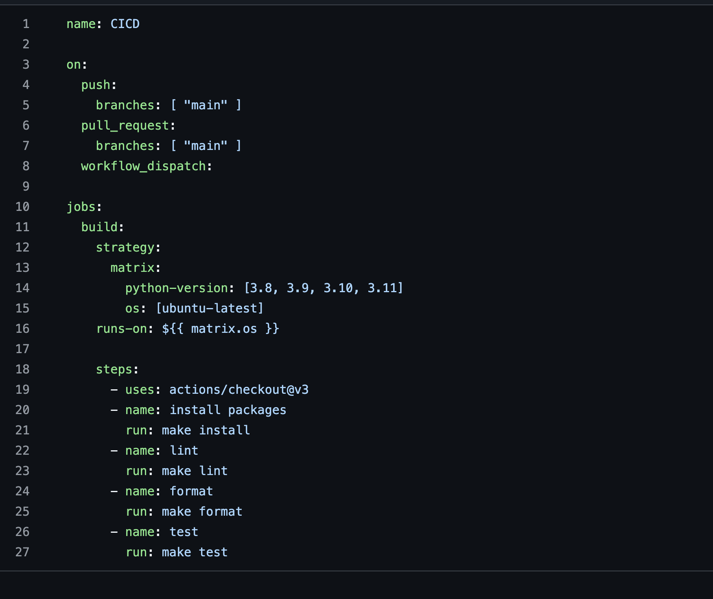
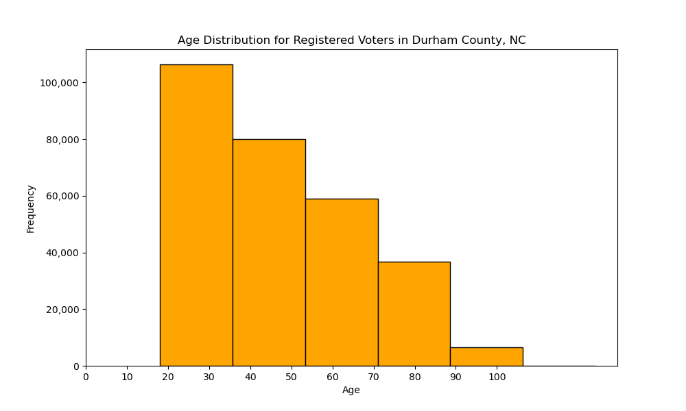
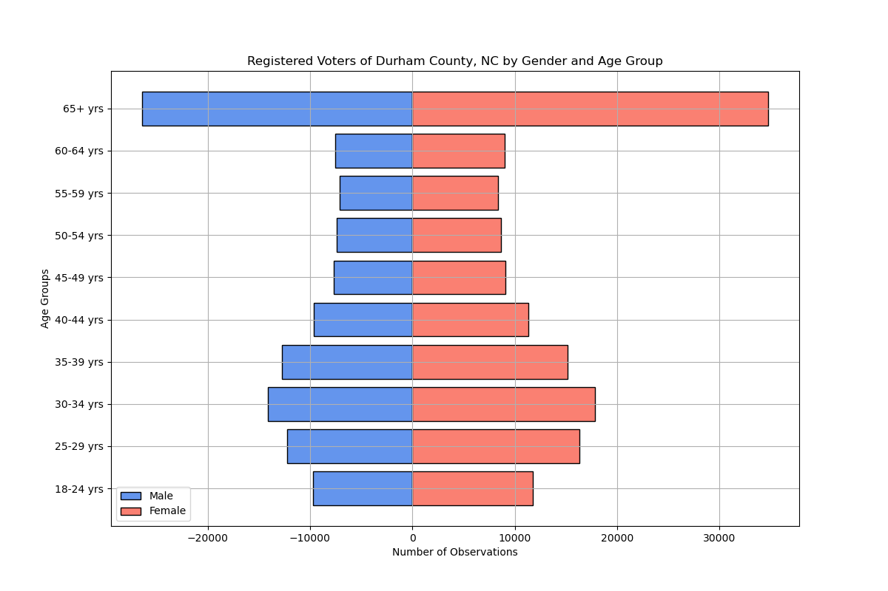

 # This is a README for IDS 706 Mini Project 4

## Note: this repository is identical to Individual Project 1, with the exception of an added Github Actions Matrix. 

Screenshot proof of Github Actions Matrix in the "cicd1.yml" file:


The matrix strategy allows us to enable the use of multiple versions of Python in this repository. To have successful builds for four versions of Python, I had to unpin the pandas, numpy and matplotlib packages in my "Requirements.txt" file.

### Status Badge
[](https://github.com/nogibjj/PeterdeGuzman_Mini4/actions/workflows/cicd1.yml)

### Youtube Video:

[](https://www.youtube.com/watch?v=uzGOJviFHMI)


### Project Motivation:
This project creates a Python script that utilizes the Pandas package to generate descriptive statistics and the Matplotlib package to produce data visualizations. I also use GitHub Actions to install required packages, lint and format the files, and test both the Python script and Jupyter notebook. 


### Data Used in this Project:
This project uses a subset of voter registration data for Durham County, North Carolina made available by the North Carolina State Board of Elections. This data was downloaded as a zipped file on September 16th, 2024. 

More information and a link to the data is available at: https://www.ncsbe.gov/results-data/voter-registration-data

### Project Directory
```
PeterdeGuzman_IndividualProject1/
├── __pycache__/
├── .devcontainer/
│   ├── devcontainer.json
│   └── Dockerfile
├── .pytestcache/
├── .ruff_cache/
├── __pycache__
├── .github/
│   └── workflows/
│       ├── format.yml
│       ├── install.yml
│       ├── lint.yml
│       └── test.yml
├── mylib/
│   └── lib.py
├── Output Images/
│       ├── age_gender_pyramid.png
│       ├── age_histogram.png
│       ├── test_histogram.png
│       └── test_populationpyramid.png
├── .gitignore
├── main.html
├── main.ipynb
├── main.pdf
├── main.py
├── Makefile
├── ncvoter32.zip
├── ncvoter89.zip
├── README.md
├── Requirements.txt
├── test_lib.py
└── test_main.py
```


### Functions Created in this Project
    1. read_csv_ncvoterdata() - this function reads in the North Carolina voter registration data, and accounts for both the value of the first row being column names and the raw file being tab-delimited.
    2. mean_age() - this function identifies the age column in the DataFrame and calculates the mean age.
    3. median_age() - this function identifies the age column in the DataFrame and calculates the median age.
    4. std_age() - this function identifies the age column in the DataFrame and calculates the standard deviation of age.
    5. recode_age_groups() - this function takes in a series of ages and groups the numbered ages into ranges such as "18-24 yrs" and "25-29 yrs". In this project, this function is applied to the "age_at_year_end" variable to create a new variable labelled "Age Group".
    6. make_categorical_age_cat() - this function converts a dataframe column titled "Age Group" into a categorical variable with ordered age groupings, from "18-24 yrs" up to "65+ yrs".
    7. generate_histogram_age() - this function identifies the age column in the DataFrame and creates a histogram to display the age distribution for registered voters in the county of interest. 
    6. generate_age_gender_pyramind() - this function creates a table of counts by "Age Group" and "gender_code" and then creates a population pyramid to display the counts by age group and gender for registered voters in the county of interest.
I also created supplementary test functions in the "test_lib.py" and "test_main.py" scripts to test the operation and output of the created functions. 


### Statistics Summary -- Registered Voters in Durham County, North Carolina

The mean age of registered voters is 46.98 years old. <br>
The median age of registered voters is 42 years old. <br> 
The standard deviation of age for registered voters is 19.42 years old. 

The counts of gender by age group for registered voters in Durham County, NC is displayed below: 
|Age Group| Female | Male | Unknown |
| :--- | :--- | :--- | :--- |                    
|18-24 yrs |   11753 |   9734 |  6018 |
|25-29 yrs |  16320 | 12216 | 6039 |
|30-34 yrs |   17805 | 14125 | 5221 |
|35-39 yrs |   15193 | 12721 | 3685 |
|40-44 yrs |   11346 |  9639 | 2381 |
|45-49 yrs |    9127 |  7652 | 1726 |
|50-54 yrs |    8667 |  7390 | 1520 |
|55-59 yrs |    8404 |  7065 | 1316 |
|60-64 yrs |    9047 |  7498 | 1296 |
|65+ yrs   |   34735 | 26378 | 2820 |

### Data Visualizations
To visualize the age distribution of registered voters in Durham County I created a simple histogram. 

I also created a population pyramid of registered voters in Durham County that displays the count of registered voters by gender code and age group. As displayed in the above Age Group by Gender table, there are records in this dataset with "Unknown" gender codes, and this visualization does not include those registered voters. 



